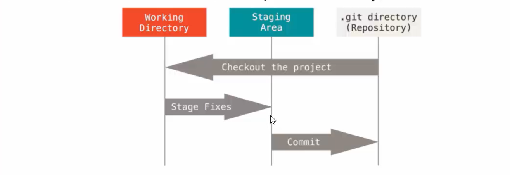
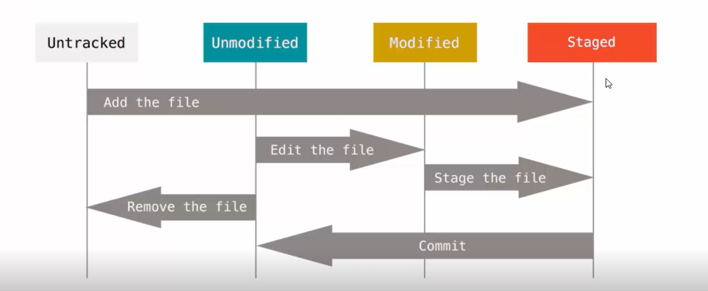

# Git et gestion de code partie 1 sur 2
## Les possibilité de git
Git permet 👍
* De versionner ses fichiers( code, images, documents, ...)
* De mettre en attente une version et de travailler sur une autre
* De pouvoir fusionner un même fichier sur lequel plusieurs personnes ont travaillé
* D'organiser son travail par version
* De publier en production son code source à partir d'une version donnée
* D'avoir une historique precise de son projet
* De pouvoir blamé quelqu'un !;-)
* .... 
## Les ressources
* [https://git-scm.com/](https://git-scm.com/): Site officiel de Git
* [http://github.com](http://github.com): Plateforme en ligne de Git
* [http://gitref.org](http://gitref.org): Pour ne jamais oublier les commandes
* [https://try.github.io](https://try.github.io): Pour s'entrainer

## Qu'est ce qu'un gestionnaire de version ?
* Enregistrer les évolutions d'un fichier
* Permet de revenir à une version précédente
* Fonctionne avec tout type de fichier(.txt, .java, .jpg, .exe, ...)
* Permet de retrouver un fichier supprimé
## Les trois états
* Un fichier modifier sous Git peut être sous 3 états:
    * **Validé,** le fichier est sauvegardé en base.
    * **Modifier,** le fichier est modifié, la modification n'est pas en base.
    * **Indexé,** le fichier est modifié, et est prêt à être envoyé en base.
  

## Les trois états
* Ce qui nous donne trois sections principales d'un projets GIT
    1. **Validé** = Le répertoire **.git**
    2. **Modifier** = Le répertoire **courant de travail**
    3. **Indexé** = La zone virtuelle qui liste les fichiers qui seront dans le prochain instantané.

## Initialisation d'un dossier 
Pour initialiser un dossier git, on tape <code>git init</code>
## Clone 

<code>git clone url</code> permet de récuperer un projet distant sur github

## Fonctionnement de git

## Vérifier l'état d'un fichier
pour connaître l'état d'un fichier, on fait <code>git status</code>
## Placer de nouveau fichiers sous suivi de version
Pour commencer à suivre un nouveau fichier, il faut lacommande <code>git add **nomfichier**</code>
## Ignoré des fichiers
Le fichier **.gitignore** permet d'ignorer les fichiers qu'on ne veut pas versionner

* Les lignes vides ou commençant par # sont ignorées.
* Les patrons standards de fichiers sont utilisables.
* Si le patron se termine par une barre oblique (/), il indique un répertoire.
* Un patron commençant par un point d'exclamation (!) indique des fichiers à exclure malgré les autre règles.
  
## Exemple de fichiers git ignore
[https://github.com/github/gitignore/](https://github.com/github/gitignore/)

## Inspecter les modifications indexées et non indexées

* Pour avoir une vision plus précise des changements faits sur les fichiers, on utilise **git diff**.
* Cette commande répond aux questions:
  * qui a été modifié, mais pas encore indexé ?
  * Quelle modification a été indexée et est prête  pour la validation ,
* **git diff** montre les changements ligne par ligne
* Pour avoir les modifications qui font partie de la prochaine validation, vous pouvez utiliser **git diff --cached**

## Valider les modification
la commande **git commit**, nous permet de valider les modification
 * avec l'option **-m** pour indiquer le message du commit.
  
## Modifier un commit 
* Attention, certaines modifications sont permanentes.
* Pour modifier un commit:
   <code>git commit --amend</code>
* Cette commande va prendre l'index du commit précédent.
* l'éditeur s'ouvre avec les modifications et le message.
* Il est possible de modifier uniquememnt le message du commit.

## Déxindexer un fichier déjà indexé
* Imaginons que vous avez indexé trop de fichiers.
  <code>git reset HEAD &lt;fichier&gt;</code>

## Ajouter des dépôts distants
* Pour ajouter des dépôts distants
  <code>git remote add &lt;nomquondesirdonneeauxprojet&gt; urlgithub</code>